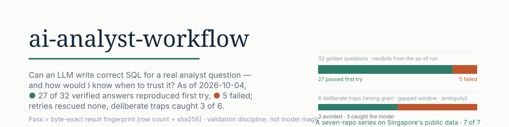
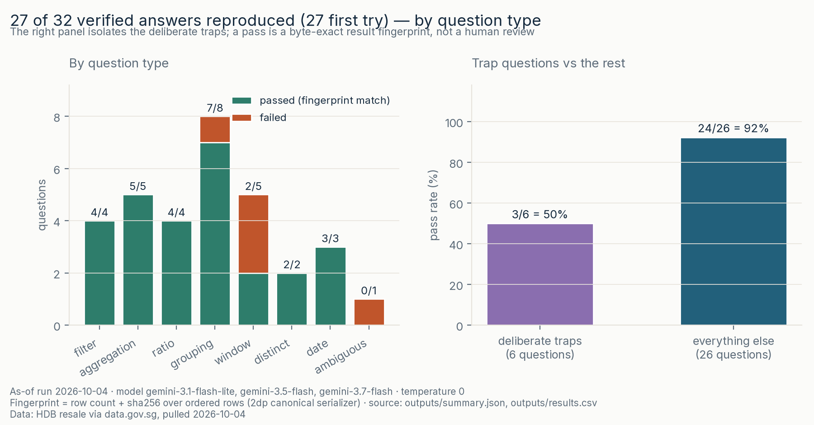
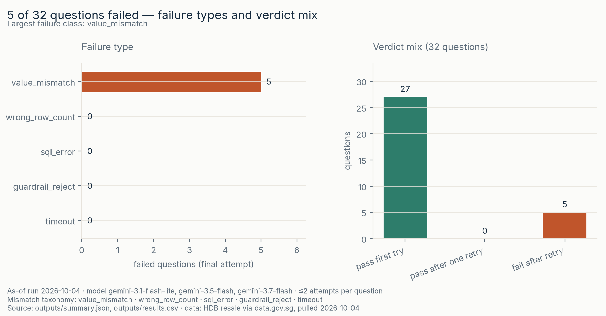

<picture>
  <source media="(prefers-color-scheme: dark)" srcset="assets/banner-dark.svg">
  <source media="(prefers-color-scheme: light)" srcset="assets/banner.svg">
  
</picture>

# ai-analyst-workflow

[](https://github.com/faizsaifulnizam/ai-analyst-workflow/actions/workflows/ci.yml) [](LICENSE)   [](https://data.gov.sg/datasets/d_8b84c4ee58e3cfc0ece0d773c8ca6abc/view) 

> **Answer:** On 2026-10-04 a free-tier LLM wrote SQL for 32 hand-written analyst questions and **27 passed on the first try** — but the part worth reading is the failures: **all 5 were value-level wrong answers that looked right** (correct row counts, wrong values), **retries rescued none of them**, and **half the deliberate traps caught the model** (3 of 6), including a `COUNT(DISTINCT block)` on a non-unique column and a row-frame window over a gapped calendar. I would trust this workflow to *catch* those mistakes — every one was caught by the result fingerprint (a hash of the actual rows returned), not by reading the SQL. In one line: I'd trust it as a **checker** for single-table analyst SQL, and I wouldn't trust the model's SQL unverified — or these numbers for multi-table work or model ranking.

**Status:** built 2026-10-04. The numbers below are the as-of receipt of **one dated run** (three free-tier Gemini model ids, pinned and explained in [docs/model_note.md](docs/model_note.md) — the free tier caps each model at 20 requests/day). Part of the Six-on-SG series — six Singapore-data analyses plus this AI workflow (seven repos).

**What I built:** the pipeline and its trust boundary, the 32 hand-written questions with verified answers, and the failure catalogue — the LLM only wrote the candidate SQL being judged.

## Key numbers (all reproducible)

- **27/32 first try · 0 after one retry · 5 fail.** Every question got ≤2 attempts; the retry saw the failed SQL plus an error class, never the expected numbers. All 5 failures are `value_mismatch` — no `sql_error`, no `guardrail_reject`, no `timeout` ([results.csv](outputs/results.csv)).
- **Traps: 3 of 6 caught the model.** Q13 (grouped on non-unique `block` → 196 instead of 295 distinct blocks), Q15 (`ROWS 2 PRECEDING` over a series with 14 missing months), Q24 (deliberately ambiguous "prices gone up in the last year"). The other three traps — Q04's near-miss `flat_model`/`flat_type` column, Q12's block grain, Q26's lease-text months — were answered correctly first try ([failure catalogue](docs/failure_catalogue.md)).
- **Where it breaks:** window questions 2/5, ambiguous 0/1, grouping 7/8; filters, aggregations, ratios, distinct and date questions all clean (18/18).
- **Everything deterministic re-derives:** 32/32 golden fingerprints reproduce from the DuckDB build (241,920 rows, 9/9 checks); re-running `src/validate.py` over the committed candidates is byte-identical; 15 verdicts re-derived from the raw CSV with stdlib `Decimal` — no DuckDB, no repo code — 0 discrepancies ([audit](docs/audit.md)).

<picture>
  <source media="(prefers-color-scheme: dark)" srcset="reports/figures/f2_pass_rate-dark.png">
  <source media="(prefers-color-scheme: light)" srcset="reports/figures/f2_pass_rate.png">
  
</picture>

*Pass rate by question type (left) and deliberate traps versus everything else (right). A pass is a byte-exact result fingerprint, not a human review. As-of run 2026-10-04.*

### The failure view

| | |
|---|---|
| <a href="reports/figures/f3_failures.png"><picture><source media="(prefers-color-scheme: dark)" srcset="reports/figures/f3_failures-dark.png"></picture></a> | Every failure in this run is a value-level mismatch: the model returned the right number of rows and the wrong values. Nothing failed on syntax or on the safety guardrails. The taxonomy in the left panel is the contract even where a class is empty — a future run that starts producing `guardrail_reject`s means the prompt or schema changed. |

All figures are generated by [code](src/figures.py), light + dark, and mirrored to `docs/img/`. [Decision memo](docs/decision_memo.md).

## The question

Almost every entry-level analytics spec now asks for AI fluency. The habit they cannot put in the ad is knowing when not to trust the output. This repo does both in one artefact: the LLM does real work over real data, and the pipeline shows exactly where its output can and cannot be trusted. The locked question: **can an LLM write correct SQL for a real analyst question on a real dataset — and how would I know when to trust it?**

The answer this build supports: *it writes plausible SQL at least as often as it writes correct SQL, and plausibility is not evidence.* 27 clean first tries looked the same as the 5 confident wrong answers — the only thing that separated them was executing both against a hand-written reference and comparing **results**, not SQL text.

## The data

- HDB resale flat prices, Jan 2017 → 2026-10 ([data.gov.sg `d_8b84c4ee58e3cfc0ece0d773c8ca6abc`](https://data.gov.sg/datasets/d_8b84c4ee58e3cfc0ece0d773c8ca6abc/view), © Housing & Development Board, Singapore Open Data Licence) — the same series as `hdb-resale-mart`. **241,920 rows**, staged into one local DuckDB table (`resale`); raw CSV stays out of git with a committed [`pull_manifest.json`](data/raw/pull_manifest.json) (sha256 + coverage).
- Cleaning mirrors the series rules with counted exclusions (0 excluded at this pull, reconciled anyway) and 9 structural checks run **before** the database file is promoted ([data audit](docs/data_audit.md)).
- The trap-relevant facts the data actually contains: `block` is **not unique** (2,785 block strings vs 9,755 physical town/street/block identities — block `'101'` sits in 20 towns; grouping by `block` counts the wrong thing — that is the Q13 trap); `flat_model` is not `flat_type` (`'2-room'` model rows are 35 of the 688 2-room flats in 2023); Hougang 2-room trades in only **22 of 36** months in 2022–2024, so row-based windows span gaps; `remaining_lease` is text with a months component in 222,076 rows.

## Method

1. **Golden set** ([eval/golden_set.yaml](eval/golden_set.yaml)) — 32 hand-written questions in analyst phrasing across 8 question types, including **6 deliberate traps** (a question whose obvious SQL is subtly wrong). Each question carries canonical SQL with a deterministic `ORDER BY` where the result has multiple rows, a one-line "why it is in the set", and a result fingerprint. Versioned.
2. **Fingerprint** ([src/fingerprint.py](src/fingerprint.py)) — one canonical result formatter (the "serializer") shared by the golden set and the comparison: every cell formatted to 2 dp (so `2017` the integer and `2017` the text are visibly different, `42` and `42.0` are not), rows joined in order, sha256 over the ordered result. Row count + hash, nothing else. Order is part of the contract.
3. **Generate** ([src/generate.py](src/generate.py)) — one prompt template ([prompts/sql_prompt.md](prompts/sql_prompt.md)) = question text + schema block, no rows. ≤2 attempts per question; attempt 2 sees attempt 1's SQL and an error class, never expected numbers. Resumable per question; runs land in `outputs/reruns/<date>/` and never overwrite the committed receipt.
4. **Guardrails** ([src/guardrails.py](src/guardrails.py)) — every candidate is executed under a trust boundary: parse-based single-SELECT check (sqlglot — a `startswith('select')` check would accept `SELECT 1; DROP TABLE resale`), table allowlist, no filesystem/catalog functions, read-only DuckDB connection, wall-clock watchdog (`con.interrupt()` after 15 s), 10,000-row cap. Runnable self-check: `python src/guardrails.py`.
5. **Validate** ([src/validate.py](src/validate.py)) — first re-derives every golden fingerprint from the live database (a moved input fails loudly instead of being silently re-pinned), then replays every committed candidate under the guardrails and compares fingerprints. Verdicts: `pass_first_try | pass_after_retry | fail` with mismatch types `sql_error | guardrail_reject | timeout | wrong_row_count | value_mismatch`.
6. **Catalogue + audit** — every failure classified with a concrete example and a next-iteration fix ([failure catalogue](docs/failure_catalogue.md)); 15 verdicts re-computed by hand from the raw CSV with stdlib `Decimal`, deliberately mixing passes and failures ([audit](docs/audit.md)).

### Rules chosen, and why

| Rule | Choice | Why |
|---|---|---|
| Comparison unit | result fingerprint (rows + sha256), never SQL text | a hundred valid SQL spellings exist; only the result is what an analyst consumes |
| Serializer | one shared canonical form, 2 dp numbers, order-sensitive | golden and candidate cannot drift apart in what "same answer" means |
| Golden SQL | hand-written, pinned readings for ambiguous questions | the moment the model writes the reference, the eval measures self-consistency |
| Traps | 6 of 32 (non-unique grain, near-miss column, gapped window, lease text, ambiguity) | the failure mode that fools a human reviewer is the one worth measuring |
| Retry cap | 2 attempts, feedback without expected numbers | measures whether feedback helps without leaking the answer |
| Execution | read-only + watchdog + row cap + parse-based SELECT-only | model output is hostile input until proven otherwise |
| Non-determinism | dated receipt; re-runs write `outputs/reruns/<date>/` | generation is not byte-reproducible; pretending otherwise would be the first lie |

### Validation — receipts, not claims

- **Golden fingerprints: 32/32 reproduce** from the database build; a changed input makes `src/validate.py` exit 1 rather than re-pin.
- **Determinism:** re-validating the committed candidates twice produced byte-identical `results.csv` (`da76ab9a…`) and `summary.json` (`8ba883ef…`), matching the committed files. Figures render twice in the same environment and the two PNGs are sha256-compared before promotion ([src/figures.py](src/figures.py)).
- **Independent audit:** 15 verdicts re-derived from the raw CSV with stdlib `csv` + `Decimal` (no DuckDB, no `src/` imports) — 14 passes confirmed and 1 failure (Q13) confirmed as a candidate-SQL fault, with Q15's failure-side check covered in the [failure catalogue](docs/failure_catalogue.md), **0 discrepancies**. Both trap contrasts reproduce (Q04: 688 vs 35; Q13: 295 vs 196) ([audit](docs/audit.md)).
- **Guardrails self-check passes** (`python src/guardrails.py`): 8 escape attempts rejected, benign SELECT accepted. This run gave them nothing to reject — 0 `guardrail_reject`, 0 `sql_error`, 0 `timeout` — which is a statement about this question set, not a claim that the guardrails are optional.
- **CI** runs a stdlib-only smoke test over the committed artifacts ([tests/smoke_test.py](tests/smoke_test.py)): schema subsets, verdict/summary agreement, per-run numeric anchors, figure presence and size floors in both themes, and a potency check that fails the suite when an implausible pass count is substituted at the loading boundary.

### What this cannot say

- **Not a benchmark, not a model ranking.** 32 questions on one table from one prompt template is a validation demo. No fine-tuning claims, no "state of the art", no cross-model leaderboard — and the as-of run spans three closely related free-tier model ids because of a daily quota wall ([model note](docs/model_note.md)), so treat the aggregate as a workflow receipt, not a model measurement.
- **Not a claim that 27/32 is "good".** The set is small and hand-written; the five failures are concentrated in exactly the areas (windows, ambiguity) where unverified SQL is most dangerous. A different 32 questions would give a different number — the number is dated, the failure classes are the durable part.
- **Not proof the guardrails are sufficient.** They reject the obvious escapes and are tested for those; a novel escape is not out of scope for a determined adversary. The row cap and watchdog bound damage, they do not eliminate it.
- **Not a statement about multi-table work.** One table on purpose: this measures single-table SQL correctness against a fixed contract. Joins, schema evolution, dialect portability and explanation quality are unmeasured.
- **Not causal or predictive.** The underlying data is transaction records; nothing here prices, forecasts or attributes anything.

### Limits

- The golden set's readings of deliberately ambiguous questions are pinned choices (documented in the YAML's `why` lines), not ground truth — Q24's mismatch is partly the question's fault and is labelled as such.
- Two failure classes are contract slips the questions could have prevented (rounding order in Q14; year label type in Q17 — the fingerprint is type-sensitive through the 2dp serializer). They are recorded as failures because the contract is the contract, with the fix noted per question in the [catalogue](docs/failure_catalogue.md).
- Generation is a receipt of 2026-10-04. Re-runs will differ; only the deterministic half (DB build, fingerprints, validation of the committed candidates) is byte-reproducible.

## Reproduce

### Linux/macOS (Bash)

```bash
git clone https://github.com/faizsaifulnizam/ai-analyst-workflow && cd ai-analyst-workflow
uv venv .venv --python 3.12
source .venv/bin/activate
uv pip install -r requirements.txt

python src/download.py
python src/build_db.py
python src/generate.py
python src/validate.py
python src/figures.py
python src/fingerprint.py
python src/guardrails.py
python tests/smoke_test.py
```

### Windows (PowerShell, no activation needed)

```powershell
git clone https://github.com/faizsaifulnizam/ai-analyst-workflow
cd ai-analyst-workflow
$env:PYTHONUTF8 = "1"
uv venv .venv --python 3.12
uv pip install --python .venv\Scripts\python.exe -r requirements.txt

.venv\Scripts\python.exe src/download.py
.venv\Scripts\python.exe src/build_db.py
.venv\Scripts\python.exe src/generate.py
.venv\Scripts\python.exe src/validate.py
.venv\Scripts\python.exe src/figures.py
.venv\Scripts\python.exe src/fingerprint.py
.venv\Scripts\python.exe src/guardrails.py
.venv\Scripts\python.exe tests/smoke_test.py
```

`python -m venv .venv` and that environment's `python -m pip install -r requirements.txt` are alternatives to uv. Use Python 3.12.

**Spot-check:** `outputs/results.csv` must show Q01 `pass_first_try` (the Tampines 2023 count is **1,634**), Q05 `pass_first_try` (2023 4-room median **S$550,000**), and Q13 `fail` / `value_mismatch` — the trap that caught the model. If those three rows read differently, you are not looking at the committed receipt.

**About re-running generation:** `src/generate.py` needs `GOOGLE_API_KEY` and skips gracefully without it; with it, a re-run writes `outputs/reruns/<date>/` and **will differ** from the committed receipt — that is expected. Compare the two `summary.json` files; never adopt silently. Everything else in the list above is deterministic and re-derives byte-identically. `src/validate.py` exits 1 on golden-fingerprint drift by design — if `src/download.py` pulls a newer dataset, re-audit before re-pinning anything.

## Out of scope

- Text-to-SQL **model research** — BIRD and Spider are accuracy benchmarks for improving models (schema linking, cross-domain generalisation). That is a research field, not a portfolio deliverable, and nothing here competes with or reproduces those leaderboards.
- **Eval harnesses and agent frameworks** — `jmpei/nl2sql-agents` and similar tooling build multi-step agents around text-to-SQL; this repo is deliberately one prompt → execute → validate loop so the validation discipline stays visible. Adjacent tooling, not prior art for this question.
- No fine-tuning, no model-quality claims, no forecasts, no causal attribution.

## Licence

Code: MIT. Data: Singapore Open Data Licence — © Housing & Development Board, via data.gov.sg. Independent, unofficial analysis.

---

*Six-on-SG: six Singapore-data analyses, plus this AI workflow — seven repos:* **[hdb-resale-mart](https://github.com/faizsaifulnizam/hdb-resale-mart)** · **[card-book-quality](https://github.com/faizsaifulnizam/card-book-quality)** · **[coe-quota-premium](https://github.com/faizsaifulnizam/coe-quota-premium)** · **[retail-sales-split](https://github.com/faizsaifulnizam/retail-sales-split)** · **[coe-category-break](https://github.com/faizsaifulnizam/coe-category-break)** · **[hdb-lease-slope](https://github.com/faizsaifulnizam/hdb-lease-slope)** · **ai-analyst-workflow**

*If you found this useful, a star helps others find it.*
